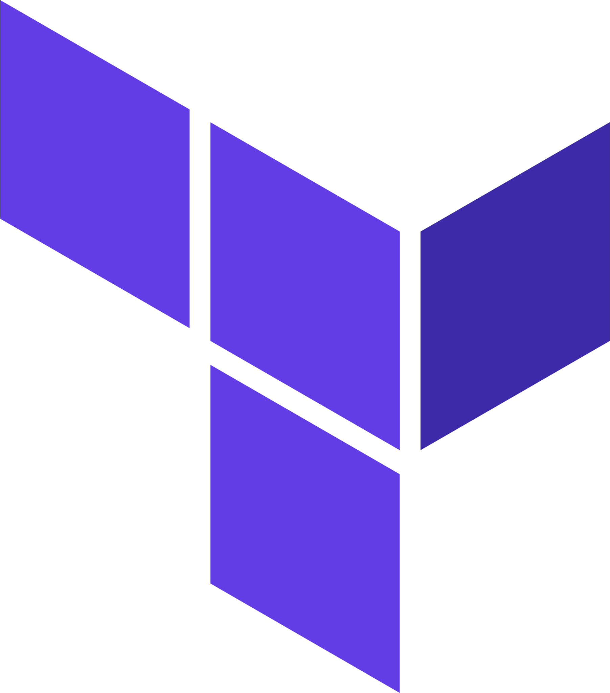
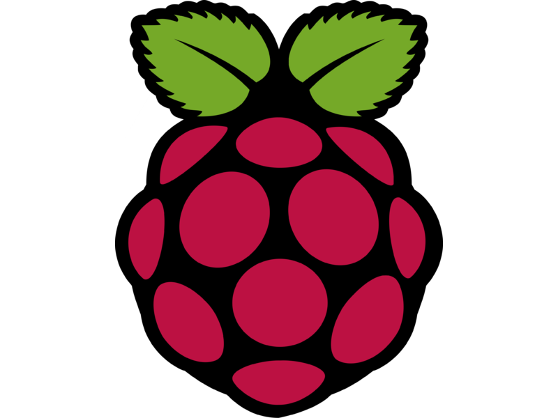

# Welcome to My Corner of GitHub! 👋

## 🔧 Platform DevOps & SysAdmin Engineer :computer:

Hello and welcome to my GitHub profile!. I'm innovative and driven Platform DevOps and SysAdmin Engineer with a passion for coding and infrastructure. I excel at bridging the gap between development and operations, ensuring seamless integration and efficiency in Infrastructure as Code (IaC) and Continuous Integration/Continuous Deployment (CI/CD) projects.  Here you'll find a collection of my personal repositories, contributions, and explorations in the realms of Infrastructure Management, DevOps Tools and System Administration.

###  What I Do?
- **Platform Engineering:** Building and optimizing reliable and scalable Infrastructure, either Onpremise or Cloud, ready to run any application using the best IaC tools:
    -  Ansible
    -  Terraform (experienced on )
- **DevOps:** Building images and K8s resources, managing containers and K8s Clusters, implementing CI/CD pipelines, automating workflows, setting up monitoring and logging systems to ensure the health and performance of servers and cloud resources. Experienced on:
    -  Docker & podman 
    -   K8s 
    -  Rancher, Lens, K9s
    -   Helm
    -   Prometheus & Grafana 
    -   Elastic
- **Automation Lover:** Automation is my standard of living, creating streamlining tools to enhance efficiency. Don't expect me to spend more than 5 minutes to do manual things, automate or die, it's not that I'm lazy.... :sleeping:. I feel true love for automation :yum:. Languages Programming I am skilled in:
    -  Python
    -  Java
    -  Bash
    -  Php
    -  Javascript & HTML

- **System Administration:** Building, configuring, managing and maintaining servers (Physical, VM's or Conainers), ensuring security, and optimizing performance.
    - Debian   
    - RedHat       
    -  Network management
    -  VM's management 
    -  DB clusters bulding
    - :octocat: Git lover :purple_heart:

## :leaves: Currently

- 🔭 I’m working on   &   Projects.
- 🌱 Learning `PHP` and `Wordpress` to design fancy Web Pages.
- 👯 Looking to collaborate on some `End-to-end` project. 
- 📫 How to reach me: [andreasscorelli@gmail.com](mailto:andreasscorelli@gmail.com)

## 🚀 My Projects
Explore some of my projects below, where I tackle real-world challenges in a funny and really easy-to-follow way:
